# Ultimate Blu-ray Disc (3D) Ripping Guide

#### Update 2016
* I have found a simpler way for converting the subtitles and encoding half-side-by-side 3D video, check [this update](update.md).
* [This suckers](http://best-tablet-converter.com/2014/11/22/ultimate-3d-blu-ray-ripping/) are stealing my title and images.
* If you find this information useful, you can support by donating on [this link](http://rodrigopolo.com/about/wp-stream-video/donate).

### Purpose of this guide
The purpose of this guide is to share the knowhow of video encoding so you can create a backup copy of your own Blu-ray Discs and watch your movies on a wider range of devices that doesn't support or have a Blu-ray Disc drive using almost only free/libre software.

**This guide does not encourage, support or endorse piracy in any way**, we are not responsible in any way on what anyone can do with this information, all the information here is provided "as is", without warranty of any kind, express or implied, including but not limited to the warranties of merchantability, fitness for a particular purpose and noninfringement. In no event shall the authors or copyright holders be liable for any claim, damages or other liability, whether in an action of contract, tort or otherwise, arising from, out of or in connection with this guide or the use or other dealings in the guide.

### Format goals
  * MKV AVCHD - format for most Smart TVs.
  * M4V AVCHD - for iTunes / Apple TV 3.
  * MKV AVCHD SBS 3D - for SBS compatible hardware, software and Smart TVs.

Yes, there are plenty of tools that can achieve the same goals with a single click, but this guide is designed to give you full control over every single step of the encoding process, achieve higher quality, get smaller and more compatible files, use the best tools available and almost 99% free/libre software, no unwanted extras included in the files, but most important, this guide will show you techniques that are bullet proof and 100% tested, the encoded files will work great on any Smart TV, Apple TV, XBMC, Stereoscopic Player, PowerDVD, etc. showing perfect results and quality.

### System Requirements
  * **Windows**: I'm running all this software on Windows 8.1 x64 on a MacBook Pro Retina, sadly, almost all of this software only runs on Windows.
  * **A Blu-ray Disc Drive**: I'm using a USB External Blu-ray Disc Drive, there are plenty of those in [Amazon](http://amzn.to/PSc9Xh)
  * **OS X**: For those who want to have an iTunes / Apple TV Compatible format.
  * **Free disk space**: at last 50GiB

### Source
The Blu-ray Disc title I'm using for this guide is "[Thor: The Dark World (2013)](http://www.amazon.com/dp/B00HERGM86)" which is a 3D Blu-ray I own.


### Software Required
* [AnyDVD HD](http://www.slysoft.com/en/anydvdhd.html): For Blu-ray Disc decryption - commercial.
* [HandBrake](http://handbrake.fr/): For easy video encoding - free,
  [Direct Download](http://handbrake.fr/rotation.php?file=HandBrake-0.9.9-1_x86_64-Win_GUI.exe).
* [eac3to](http://www.videohelp.com/tools/eac3to): For media information, demuxing and audio encoding - free,
  [Direct Download](http://www.videohelp.com/download/eac3to327.zip).
* [SubtitleEdit](https://github.com/SubtitleEdit/subtitleedit/releases): To convert `.bup` subtitles into `.srt` subtitles (OCR) - free,
* [MKVToolNix](http://www.fosshub.com/MKVToolNix.html): To mux (join) all the track together - free,
  [Direct Download](http://www.fosshub.com/download/mkvtoolnix-amd64-6.8.0.7z).

### Steps

To convert a Blu-ray Disc into a MKV or M4V video file we have to do the following steps:

1. [Install all the software necessary](#system-preparation).
2. [Extract all the desired tracks](#demuxing).
3. Encode and convert all the tracks one by one.
  1. [Video Encoding](#video-encoding)
  2. [Audio Encoding](#audio-encoding)
  3. [Subtitles OCR](#subtitles)
4. [Join all the encoded and converted tracks into a single file (mux or remux)](#remuxing).

## System Preparation
First, we need to have all the necessary tools for video encoding, demuxing and muxing correctly installed.

1. Install AnyDVD HD to have unencrypted access to your Blu-ray Disc.
2. Install HandBrake.
3. Create a folder to store all the free software that doesn't require installation, for this guide I'm going to use the folder `c:\brdsoft`.
4. Add the `c:\brdsoft` to your system path:
  1. Right click on the bottom left corner of Windows 8.1 to access the menu and then click "System":  
  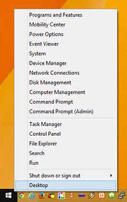
  2. On the "System" window click on the "Advanced system settings":  
  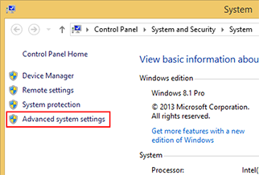
  3. On the "System Properties" windows, click on the "Environment Variables" button:  
  
  4. On the "Environment Variables" windows, edit the "PATH" on the "User variables" list and add the path   where you'll put the software with a `;` at the beginning `;C:\brdsoft`:  
  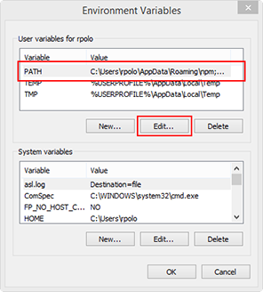
  5. Click on the "Ok" button and close all windows:  
  
5. Uncompress the `eac3to327.zip` file into the directory:  
  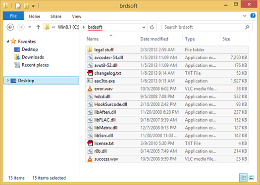
6. Uncompress the `SubExtractor1031.zip` file into the directory.
7. Uncompress the `suprip-1.16.rar` file into the directory.
8. Uncompress `mkvtoolnix-amd64-6.8.0.7z` into directory:  
  
9. Create a folder for your rip, in this guide I'll use: `C:\bdrip`:  
  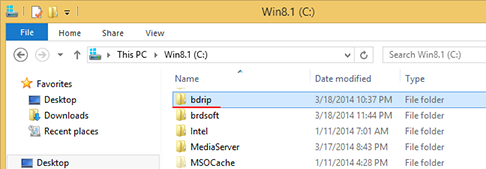


### Demuxing
1. Check which drive letter identify your Blu-ray Disc, mine is `D:`:  
  
2. Using your Command Prompt, go to your rip directory.  
  
3. Type `eac3to D:` to list all playlist tracks on the disc:  
  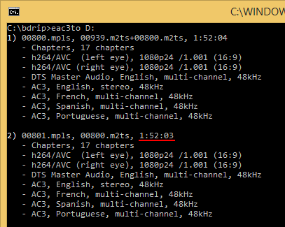
4. Now let's check the playlist information by typing `eac3to D: 2)`:  
  
5. Now let’s see which tracks to extract from the disc, you have to choose which fit your preference, typically you'll choose the chapters track, the main video track(s), the original audio track, the audio track that is on my native language, the original subtitles, the subtitles in my native language.
6. To extract my desired tracks I type the following command:  
  ```eac3to D: 2) 1:chap.txt 2:left.h264 3:right.h264 4:en.dts -core 7:es.ac3 9:en.sup 11:es.sup```  
  This command tells `eac3to` to extract (demux) form the `D:` drive, from the `2)` playlist, the `1:` track as a chapter file, the `2:` track as a left eye H264 video stream, the `3:` track as the right eye H264 stream (which is not an standard H264 stream but an *AVC Stereo* stream), the `4:` English audio track on DTS Core format (core means 5.1), the `7:` Spanish audio track on AC3/Dolby format, the `9:` English subtitles track, and finally the `11:` Spanish subtitles track:  
  
7. The extracted file tracks should look like this:  
  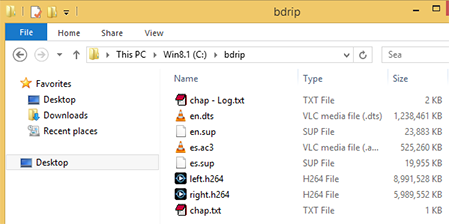


> **IMPORTANT**: Write down the length of the track and the frame rate, we will use this values later, in this guide the track length is `1:52:03` and the frame rate is `24p /1.001` (29.976).

> **Note on Video**: For this guide I'm using a 3D movie, there is nothing to worry about, the main difference between a 2D and a 3D is the extra video track for the right eye, if you don't want to create a 3D movie you can ignore the extraction of this track.

> **Note on Audio**: Most Home Theater Systems support Dolby Digital up to 5.1, [Apple TV 3](http://support.apple.com/kb/sp648), [Logitech Z-5500](http://reviews.cnet.com/pc-speakers/logitech-z-5500/4507-3179_7-31115626.html) and [Z906](http://www.logitech.com/en-us/product/speaker-system-z906) Speaker Systems doesn't support more than 5.1, that's why we are not using the 7.1 DTS audio track but the 5.1 core track, but is up to you to use DTS 7.1 instead.

### Video Encoding

#### For most Smart TVs and Apple TV

1. For encoding we will use *HandBrake*, but first we have to give *HandBrake* a video format that can understand, *HandBrake* can't encode a H.264 file directly, so we have to mux the file into an MKV container, open `mmg.exe` on the `C:\brdsoft\mkvtoolnix` folder.  
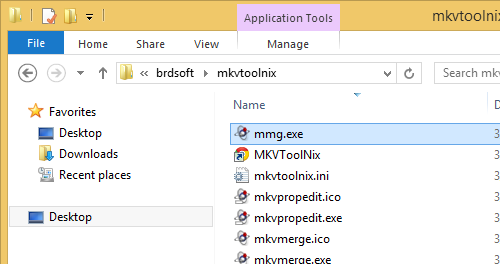
2. Drag your `left.h264` track file into the *mkvmerge GUI* window:  
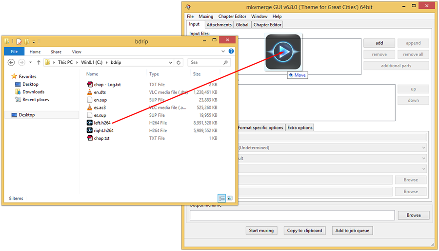
3. After dragging your track, *mkvmerge GUI* will automatically define an output file name for your video, just click on the "Start muxing" button and wait until it finishes:  

4. After muxing, click the *Ok* button and close *mkvmerge GUI*, then, open *HandBrake*, and drag the `left.mkv` we just created to the *HandBrake* window.
5. Because we want a very compatible file, we will select the `Apple TV 3` preset from the presets on the right. *HandBrake* automatically decide how to crop the video, this is useful but sometimes isn't accurate, I'll fix the crop option to keep the removal of the letterboxing but not the left and right pixels, and after that I'll make sure the video width is `1920`:  

6. Now, knowing my video isn't interlaced, I'll disable any filter on the filter tab:  
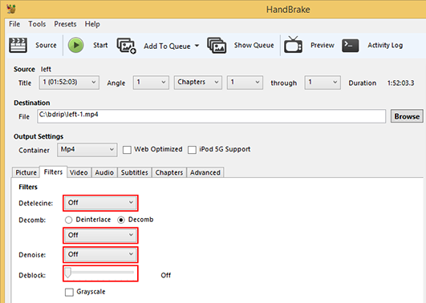
7. Knowing my video track run at `23.976fps` I'll set that value and select `Constant frame rate`, this is mainly because sometimes *HandBrake* doesn't know how to handle frame rates, then enable the `Fast decode` check box to make it friendly with more devices, and finally on `x264 Tune` set it to `Film`, you can choose a more convenient tune depending on your content, for animated movies "Animation" works best:  

8. **IMPORTANT**: Since we don't have any audio, subtitle or chapter included (we are only encoding the video track), let's disable any option on the tabs, also, **we will use MKV as our output format** so it can be remuxed later:  
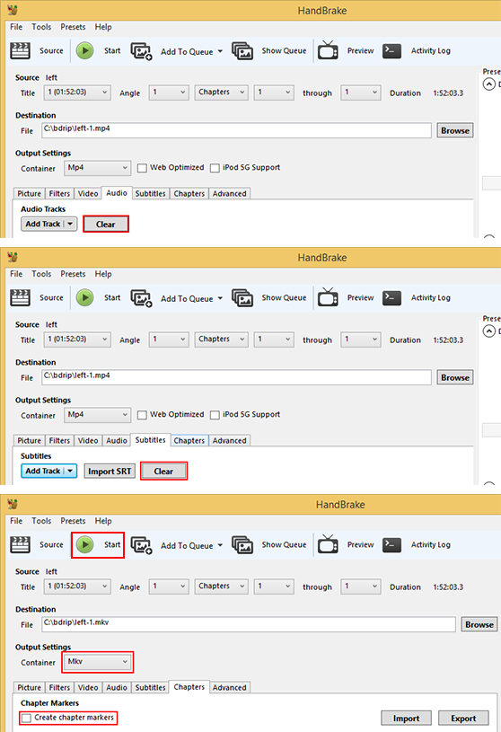
9. Then press the *Start* button and wait for the encoding to finish.
10. After the video encoding is done, we do the [audio encoding](#audio-encoding).

#### 3D SBS Video Encoding
Check the updated instructions in the [update.md](update.md) file.


### Audio Encoding

This step is easy, but first let's understand why we have to encode the audio tracks, first is the compatibility factor, AC3/A52/Dolby is the most supported digital audio format out there, DTS is not, second, Apple TV can't handle DTS, and third and most important, recoding the audio save a lot of disk space.

The most common audio formats on Blu-ray Discs are DTS and Dolby, and the most common audio channel configurations are 5.1 and 7.1, eventually mono and 6.1 (Star Wars for example). `eac3to` is mainly an audio encoding tool and it really shines at that, we are going to encode audio with this tool, if you are a truly audio enthusiast and really want a *super-human-ear-quality-audio* you should check how to enable [superior quality decoders](http://en.wikibooks.org/wiki/Eac3to/How_to_Use#Audio_Decoders) into `eac3to`.

In this case we have two audio tracks, `en.dts` is the English DTS 5.1 audio track which was extracted from the "DTS-HD Master Audio 7.1" audio track, and `es.ac3` is the Dolby 5.1 Spanish audio track.

First let's encode the English audio on the Command Prompt using the following command:

```
eac3to en.dts en_encoded.ac3 -448
```


This command tells `eac3to` to encode the `en.dts` track into a Dolby audio track `en_encoded.ac3` with 448Kbps audio quality, the quality you use is at your discretion but from my personal experience with many digital/optical audio speakers systems I can tell that there is not a significant perceptible difference in quality going beyond 448Kbps, but it is a significant hard drive space wasted, so the decision is up to you.

Now let's encode the "es.ac3" audio track on the command prompt with the following command:

```
eac3to es.ac3 es_encoded.ac3 -448
```


That's all with the audio encoding, the original English audio track uses 1.18GiB (1,268,183,720 bytes) and the reencoded audio uses only 359MiB (376,506,368 bytes), that is 3.36 times less (70.31%) than the original, same thing with the Spanish audio track, from 512 MiB (537,866,240 bytes) to 359MiB (376,508,160 bytes) 30% less.

> **Fun fact**: "eac3to" encode Dolby audio using "Aften", which is a free/open source library for Dolby encoding, the name "Aften" came from "A Fifty-Two ENcoder", Dolby is also known as a A52 audio format.

### Subtitles
Check the updated instructions in the [update.md](update.md) file.

### Remuxing
Now that we have the video and audio tracks encoded we join them together, this action is commonly known as muxing or remuxing, for that task we use *mkvmerge GUI*, open `mmg.exe` which is located on your `C:\brdsoft\mkvtoolnix` folder.

We haven't prepared our chapters track, first select **Chapter Editor** tab on the *mkvmerge GUI* window, then drag the `chap.txt` file into the tab.


Now is up to you naming your chapters as `Chapter 1`, `Chapter 2`, etc. You can also name them as the chapter name it has in the disc box (Some music concerts have chapter names) or leave it as is.

After naming your chapters save your chapter xml file by clicking on the "`Chapter Editor->Save as`" menu, I use the file name `chap.xml`.


#### Remux for most Smart TVs and preparing for Apple TV

This MKV file will include an arrangement of the tracks in the following order:

1. Video: `left-1.mkv` (the one encoded with HandBrake)
2. English Audio Track: `en_encoded.ac3`
3. Spanish Audio Track: `es_encoded.ac3`
4. English Subtitles: `en.srt`
5. Spanish Subtitles: `es.srt`

Now, select the **Input** tab on *mkvmerge GUI* window and drag one by one in order each file into the *mkvmerge GUI* window and then uncheck the **Global tags** track, it has to look like this:

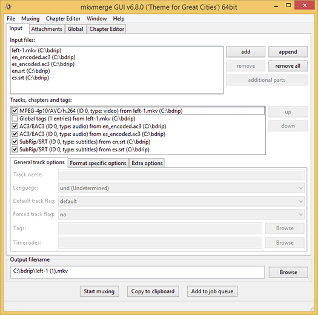

Now let's specify some details on each track, set the language of the audio tracks and subtitle tracks:


Set the subtitle encoding to UTF8 on each subtitle track:


Set the chapter track, click on the **Global** tag, on the **Chapters file** browse and select the XML chapter file we made before `chap.xml`:

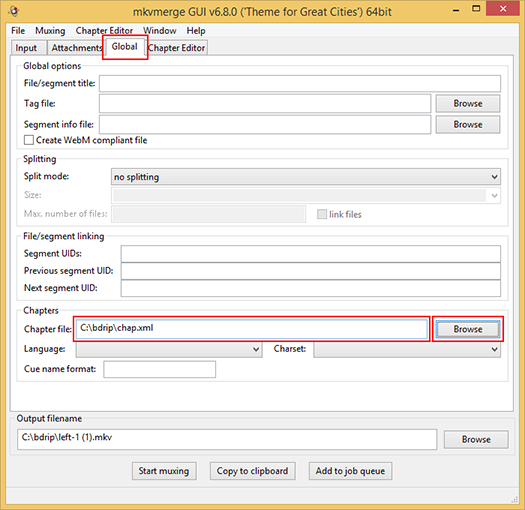

> **IMPORTANT**: Set the output file name, it is highly recommended to name your file with the movie title as it appears on [IMDB](http://www.imdb.com), with the name of the movie and the year, in this way media player, media centers and other video software an lookup information about your movie on the internet, XBMC and iFlicks do it in that way, I'll name my file "*Thor - The Dark World (2013).mkv*".

Then click the **Start muxing** button:

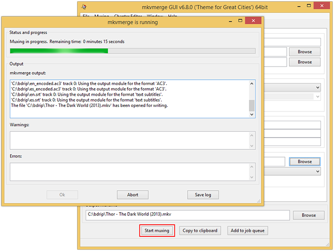

And we are done, here are the final file specs:

```
Name.........: Thor - The Dark World (2013).mkv
Size.........: 3.80 GiB
Duration.....: 01:52:03.384
Resolution...: 1920x800
Codec........: AVC High@L4.0
Bitrate......: 3 858 Kbps
Framerate....: 23.976 fps
Aspect Ratio.: 2.40:1
Audio........: English 448 Kbps CBR 6 chnls AC3
Audio........: Spanish 448 Kbps CBR 6 chnls AC3
Subs.........: English, Spanish.
```

#### For Apple TV and modern iOS devices

To create a M4V file compatible with *Apple TV 3* and most modern iOS devices we process the MKV file we just created in [the previous step](#remux-for-most-smart-tvs-and-preparing-for-apple-tv) with the commercial app [iFlicks 2](http://itunes.apple.com/us/app/iflicks-2/id731062389), to avoid video re-encoding by this app always use `X264 High Profile, Level 4` when encoding video. In this guide I'll use the `Thor - The Dark World (2013).mkv` we just make in [the previous step](#remux-for-most-smart-tvs-and-preparing-for-apple-tv), check [the following video on how to use iFlicks 2](http://youtu.be/xatcZ0PGxiE):

[](http://youtu.be/xatcZ0PGxiE)

*iFlicks 2* automatically create the stereo version of each Dolby audio track, it adds all the necessary metadata, cover, and remux the movie as a M4V video ready to be used on iTunes or any modern iOS device.

Here are the final *iFlicks 2* file specs:

```
Name.........: Thor - The Dark World (2013).m4v
Size.........: 4.07 GiB
Duration.....: 01:52:03.370
Resolution...: 1920x800
Codec........: AVC High@L4.0
Bitrate......: 3 953 Kbps
Framerate....: 23.976 fps
Aspect Ratio.: 2.40:1
Audio........: English 164 Kbps VBR 2 chnls AAC LC
Audio........: English 448 Kbps CBR 6 chnls AC3
Audio........: Spanish 164 Kbps VBR 2 chnls AAC LC
Audio........: Spanish 448 Kbps CBR 6 chnls AC3
Subs.........: English, Spanish.
```

#### MKV for Side-by-side 3D File

Let's open *mkvmerge GUI* again and repeat almost the same steps as in the [For most Smart TVs and preparing for Apple TV](#remux-for-most-smart-tvs-and-preparing-for-apple-tv) step with one small difference, **the video track**, so this MKV file will include an arrangement of the tracks in the following order:

1. Video: `sbs.h264` (the one encoded with X264 and AviSynth)
2. English Audio Track: `en_encoded.ac3`
3. Spanish Audio Track: `es_encoded.ac3`

So just as in the [For most Smart TVs and preparing for Apple TV](#remux-for-most-smart-tvs-and-preparing-for-apple-tv) step, set the language on all audio tracks, **DO NOT INCLUDE SUBTITLE TRACKS**, subtitle tracks don't work well on Side-by-side 3D because when the movie is shown it blends both sides of the video, so you will see the half subtitles on each eye, you can create a 3D subtitle with [3DSubtitler](http://www.videohelp.com/tools/3DSubtitler) and include them when muxing the video, but again, the result don’t work very well, this is mainly because when you are watching a 3D movie ([stereoscopic movie](http://en.wikipedia.org/wiki/Stereoscopy)) your eyes are focusing on the main subject on each scene, when you try to read the subtitles your focus point changes, this is very exhaustive to your eyes, I'll not recommend using subtitles but is up to you.


> **IMPORTANT**: Some media players can read the 3D information from the MKV file, 3D is in fact [Stereoscopy](http://en.wikipedia.org/wiki/Stereoscopy), so let's set this setting selecting the video track, clicking the *Format specific options* and then choosing *side by side (left first)* option.


Then set the file name, in this case I will use the [Thor - The Dark World (2013) SBD-3D.mkv] file name so I'll know that it is a 3D movie, finally click the *Start muxing* button.

And we are done, here are the final file specs:

```
Name.........: Thor - The Dark World (2013) SBD-3D.mkv
Size.........: 3.78 GiB
Duration.....: 01:52:03.360
Resolution...: 1920x1080
Codec........: AVC High@L4.0
Bitrate......: 3 839 Kbps
Framerate....: 23.976 fps
Aspect Ratio.: 16:9
Audio........: English 448 Kbps CBR 6 chnls AC3
Audio........: Spanish 448 Kbps CBR 6 chnls AC3
```

## Results

On XBMC

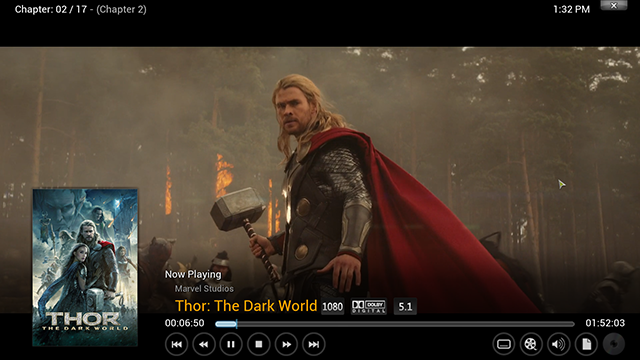

On QuickTime OS X

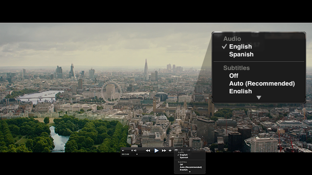

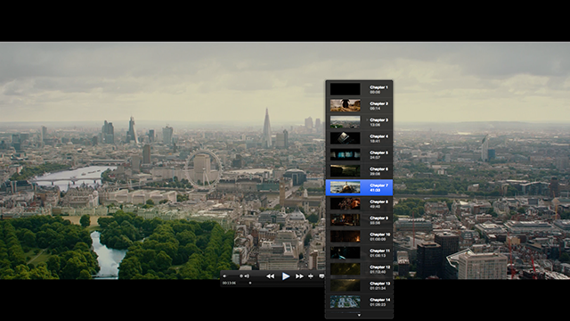

On iTunes

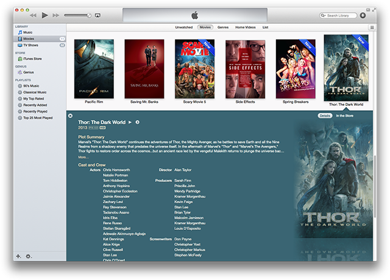

On Windows and OS X

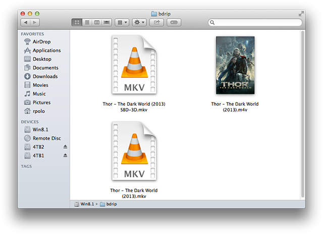

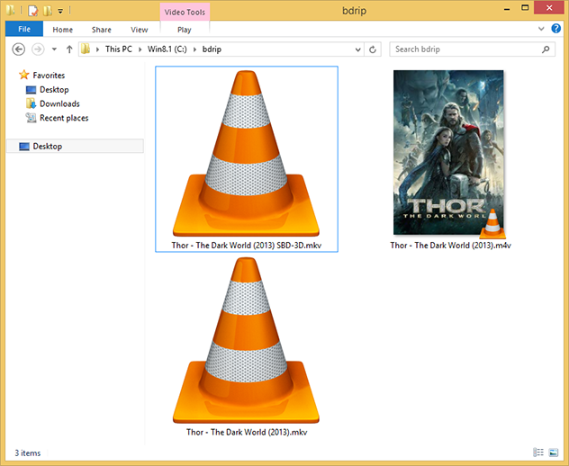

SBS On VLC Windows

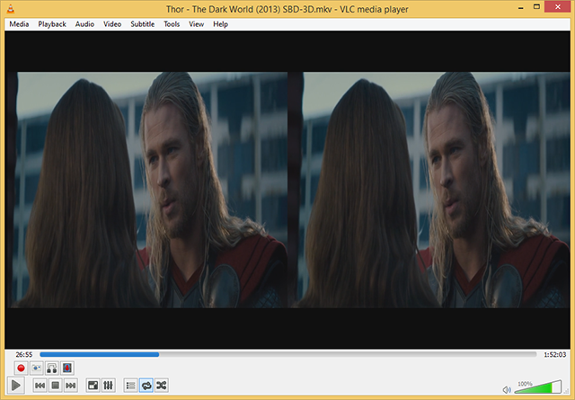

SBS Interlaced on Stereoscopic Player Windows

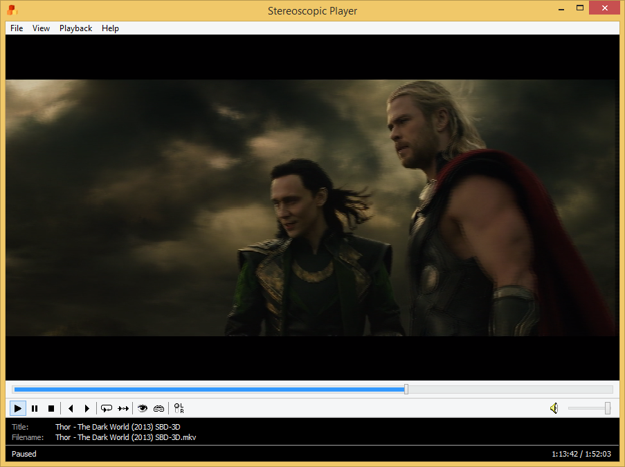

On iOS

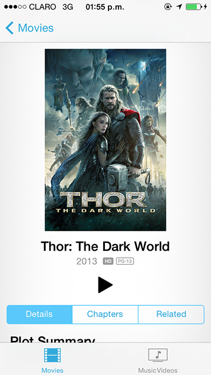

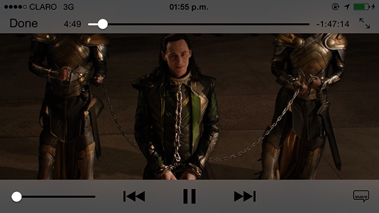

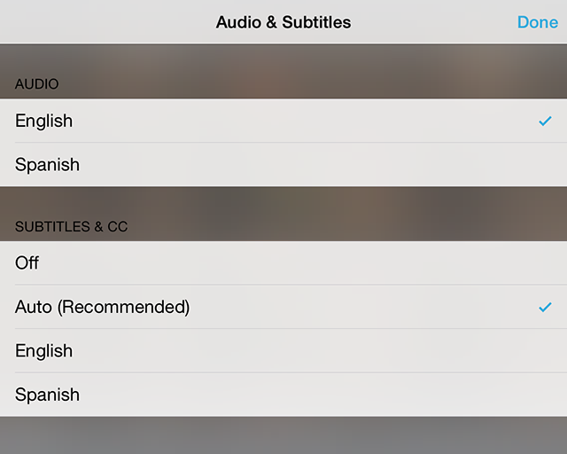

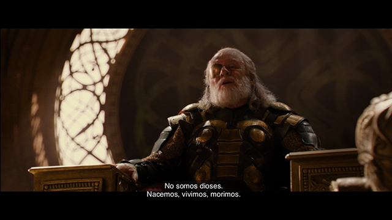

If you find this information useful, you can support by donating on [this link](http://paypal.me/rodrigopolo).