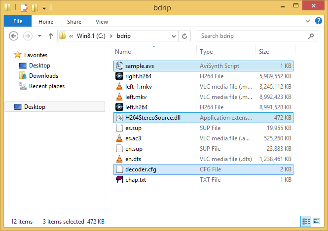
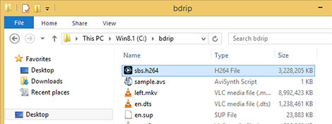
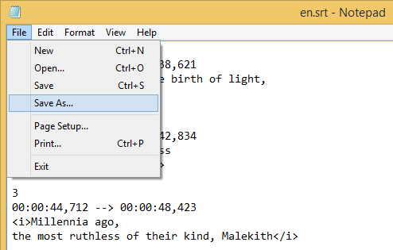

# Ultimate Blu-ray Disc (3D) Ripping Guide

### Propósito
El propósito de esta guía es compartir el conocimiento necesario para codificar vídeo de manera que el usuario pueda codificar sus propios discos Blu-ray y ver películas en una mayor gama de dispositivos que no son compatibles o no tienen un dispositivo Blu-ray usando casi exclusivamente software libre.

**Esta guía no fomenta, apoya o avala la piratería en cualquiera de sus formas**, no nos hacemos responsables en cualquier forma de lo que el usuario pueda hacer con esta información, toda la información aquí obtenida se entrega "tal cual", sin garantía de ningún tipo, ya sea expresa o implícita, incluyendo, a modo enunciativo, cualquier garantía de comerciabilidad, idoneidad para un fin particular y de no-infracción. En ningún caso los autores o titulares del copyright serán responsables de ninguna reclamación, daños u otras responsabilidades, ya sea en un litigio, agravio o de otro modo, resultantes de o en conexión con esta guía, su uso u otro tipo de acciones en la guía.

### Formatos finales
  * MKV AVCHD - Formato para la mayoría de Smart TVs.
  * M4V AVCHD - para iTunes / Apple TV 3.
  * MKV AVCHD SBS 3D - para Smart TVs, hardware y software compatible con SBS 3D.

Sí, existen más herramientas con las que se puede obtener los mismos resultados usando sólo un par de clics, pero esta guía está diseñada para darle un control absoluto de cada paso en la codificación del vídeo, lograr mejor calidad de vídeo, obtener archivos más pequeños y compatibles, aprender a usar las mejores herramientas disponibles y en un 90% software libre, sin extras incluidos en los archivos, pero más importante, esta guía le mostrará técnicas infalibles y 100% probadas, los vídeos resultantes funcionarán de maravilla en la mayoría de Smart TVs, Apple TV, XBMC, Stereoscopic Player, PowerDVD, etc. mostrando resultados prácticamente perfectos con gran calidad.

### Requerimientos de Sistema
  * **Windows**: Todo el software en esta guía está corriendo en Windows 8.1 x68 usando una MacBook Pro Retina, lamentablemente la mayoría de este software sólo corre en Windows.
  * **Una Unidad Blu-ray**: Utilizo una unidad Blu-ray USB Externa, existen muchas de estas en [Amazon](http://amzn.to/PSc9Xh)
  * **OS X**: Para aquellos que quieren tener un archivo compatible con iTunes / Apple TV y iOS.
  * **Espacio Libre en Disco**: Al menos unas 50GiB

### Fuente
El título del disco Blu-ray que utilizaré en esta guía es "[Thor: The Dark World (2013)](http://www.amazon.com/dp/B00HERGM86)" el cual es un Blu-ray de mi propiedad.


### Software necesario
* [AnyDVD HD](http://www.slysoft.com/en/anydvdhd.html): Para desencriptación del disco Blu-ray - comercial.
* [HandBrake](http://handbrake.fr/): Para una codificación de vídeo fácil - gratuito,
  [Direct Download](http://handbrake.fr/rotation.php?file=HandBrake-0.9.9-1_x86_64-Win_GUI.exe).
* [eac3to](http://www.videohelp.com/tools/eac3to): Para obtener información del disco, extraer las pistas y codificar el audio - gratuito,
  [Direct Download](http://www.videohelp.com/download/eac3to327.zip).
* [SubExtractor](http://www.videohelp.com/tools/SubExtractor): Para convertir archivos de subtítulos `.bup` a archivos `.srt` vía (OCR) - gratuito,
  [Direct Download](http://www.videohelp.com/download/SubExtractor1031.zip).
* [SupRip](http://www.videohelp.com/tools/SupRip): Para convertir archivos de subtítulos `.bup` a archivos `.srt` vía (OCR) - gratuito,
  [Direct Download](http://www.videohelp.com/download/suprip-1.16.rar).
* [MKVToolNix](http://www.fosshub.com/MKVToolNix.html): Para unir todas las pistas  - gratuito,
  [Direct Download](http://www.fosshub.com/download/mkvtoolnix-amd64-6.8.0.7z).

### Pasos

Para convertir un disco Blu-ray a un archivo MKV o MP4 se deben seguir los siguientes pasos:

1. [Instalar el software necesario](#preparaci%C3%B3n-del-sistema).
2. [Extraer las pistas deseadas](#demuxing).
3. Encode and convert all the tracks one by one.
  1. [Codificar el vídeo](#codificaci%C3%B3n-de-v%C3%ADdeo)
  2. [Codificar el audio](#codificaci%C3%B3n-de-audio)
  3. [Convertir los subtítulos](#subt%C3%ADtulos)
4. [Unir todas las pistas recodificadas y convertidas en un sólo archivo(mux o remux)](#remuxing).

## Preparación del sistema

Primero, tenemos que tener instaladas todas las herramientas para codificación de vídeo, muxeo y demuxeo correctamente instaladas.

1. Instala AnyDVD HD para tener acceso desencriptado a tu unidad de disco Blu-ray.
2. Instala HandBrake.
3. Crea una folder para guardar todo el software libre que no requiere instalación, en esta guía utilizaré el folder `c:\brdsoft`.
4. Agrega el folder `c:\brdsoft` a tu path de sistema:
  1. haz clic derecho en el botón de la esquina inferior izquierda de Windows 8 para acceder al menú, luego haz clic en "Sistema":  
  
  2. En la ventana de "Sistema" haz clic en "Configuración avanzada del sistema":  
  
  3. En la ventana de "Propiedades del Sistema" haz clic en el botón "Variables del entorno":  
  
  4. En la ventana "Variables de entorno", edita la que se llama "PATH" en el listado de "Variables de usuario", y agrega la ruta donde estamos poniendo el software utilizando un `;` al inicio, quedando así `;C:\brdsoft`:  
  
  5. Haz clic en "Ok" y cierra todas las ventanas:  
  
5. Descomprime `eac3to327.zip` en el directorio que agregamos al path:  
  
6. Descomprime el archivo `SubExtractor1031.zip` en el directorio.
7. Descomprime el archivo `suprip-1.16.rar` en el directorio.
8. Descomprime el archivo `mkvtoolnix-amd64-6.8.0.7z` en el directorio:  
  
9. Crea un folder para realizar la conversión, en esta guía utilizaremos el folder: `C:\bdrip`:  
  


### Demuxing
1. Identifica qué letra representa tu dispositivo de disco Blu-ray, en mi caso es la unidad `D:`:  
  
2. Utilizando la Consola de Comandos, accede a la carpeta de conversión.  
  
3. Escribe `eac3to D:` para obtener ver todas las pistas de listas de reproducción en el disco:  
  
4. Ahora veamos la información de la lista de reproducción escribiendo `eac3to D: 2)`:  
  
5. Ahora veamos qué pistas extraer del disco, debes elegir cuales son de tu preferencia, generalmente eligirías la pista de capítulos, las principales pistas de vídeo, el audio original, la pista de audio en tu idioma nativo, los subtítulos originales y los subtítulos en tu idioma nativo.
6. Para extraer las pistas deseadas escribe el siguiente comando:  
  ```eac3to D: 2) 1:chap.txt 2:left.h264 3:right.h264 4:en.dts -core 7:es.ac3 9:en.sup 11:es.sup```  
  Este comando ejecuta `eac3to` y le dice que extraiga (haga el demux) de la unidad `D:`, de la pista de reproducción `2)`, la pista `1:` como una pista de capítulos, la pista `2:` como la secuencia de vídeo izquierda H264, la pista `3:` como la secuencia de vídeo derecha H264 (la cual no es una secuencia H264 estándar sino una pista *AVC Stereo*), la pista de audio en inglés `4:` a formato DTS Core (Core significa 5.1), la pista de audio en español `7:` a formato AC3/Dolby format, the pista de subtítulos en inglés `9:`, y finalmente la pista de subtítulos en español `11:`:  
  
7. Las pistas extraídas deberían verste como este listado de archivos:  
  


> **IMPORTANTE**: Anota la duración del vídeo y los cuadros por segundo, usaremos estos valores luego, en este caso la duración es de `1:52:03` y los cuadros por segundo son `24p /1.001` (29.976).

> **Nota acerca del vídeo**: En esta guía estoy utilizando una película 3D, no hay nada de qué preocuparse, la principal diferencia entre 2D y 3D es la pista extra de vídeo para el ojo derecho, si no deseas codificar una película 3D puedes ignorar extraer esta pista.

> **Nota acerca del audio**: La mayoría de sistemas de teatro en casa llegan a reproducir Dolby Digital hasta 5.1, El [Apple TV 3](http://support.apple.com/kb/sp648), Sistemas de sonido como [Logitech Z-5500](http://reviews.cnet.com/pc-speakers/logitech-z-5500/4507-3179_7-31115626.html) y [Z906](http://www.logitech.com/en-us/product/speaker-system-z906) no reproducen audio con más de 5.1 canales, es por esta razón que no utilizamos el sonido en DTS 7.1 sino que extraemos la pista Core 5.1, sin embargo dejamos a tu gusto si deseas utilizar la pista DTS 7.1 original en su lugar.

### Codificación de vídeo

#### Para la mayoría de Smart TVs y Apple TV

1. Para la codificación del vídeo utilizaremos *HandBrake*, pero primero debemos darle a *HandBrake* un formato de vídeo que pueda entender, *HandBrake* no puede decodificar un archivo H264 directamente, así que tenemos que encapsular el  vídeo (mux) dentro de un archivo contenedor MKV, ejecuta el programa `mmg.exe` en el folder `C:\brdsoft\mkvtoolnix`.  

2. Arrastra el archivo `left.h264` hacia la ventana de *mkvmerge GUI*:  

3. Luego de arrastrar el archivo, *mkvmerge GUI* automáticamente define el nombre del archivo de salida, sólo haz clic en el botón "Start muxing" y espera a que el proceso termine:  

4. Luego de realizar el "muxing", haz clic en el botón *Ok* y cierra *mkvmerge GUI*, luego, abre *HandBrake*y arrastra el archivo `left.mkv` que recién creamos a la ventana de *HandBrake*.
5. Como deseamos un archivo muy compatible, seleccionaremos el preset de `Apple TV 3` de entre el listado de presets de la derecha. *HandBrake* automáticamente decide cómo recortar el vídeo, esto es útil pero en ocasiones no es preciso, arreglaré la opción de "crop" para que pueda remover el "letterboxing" pero que no recorte los pizeles de derecha e izquierda del vídeo, luego me aseguro que mi vídeo tenga un ancho de `1920` pixeles:  

6. Ahora, sabiendo que mi vídeo NO es "entrelazado", desacrivaré cualquier filtro en la pestaña de filtros:  

7. Sabiendo que mi vídeo corre a `23.976fps` configuraré esa opción y me aseguraré de seleccionar `Constant frame rate`, esto debido a que en ocasiones *HandBrake* no reconoce cómo trabajar el frame rate del vídeo, luego activo la opción de `Fast decode` para hacerlo amigable con más dispositivos, y finalmente, en `x264 Tune` selecciono la opción de `Film`, puedes elegir una opción más conveniente dependiendo de tu contenido, para películas animadas "Animation" funciona mejor:  

8. **IMPORTANTE**: Como no estamos codificando más que vídeo, desactivemos cualquier otra opción en el resto de pestañas, también, **seleccionaremos que el formato del archivo sea MKV** así podemos procesarlo (remux) luego:  

9. Al terminar de seleccionar las opciones hacemos clic en el botón de *Start* y esperamos que la codificación termine.
10. Cuando la coficicación termine realizaremos la [codificación de audio](#codificaci%C3%B3n-de-audio).

#### Para vídeo 3D SBS

La codificación de vídeo Side-by-side 3D (vídeo lado-a-lado) es un tanto especial, los discos Blu-ray 3D tienen dos secuencias de vídeo diferentes, una para cada ojo, así que la codificación requiere unir la secuencia de vídeo "derecha" e "izquierda" en un solo vídeo, luego compacta el ancho de ambos vídeos para encajar el ancho original, pero hay algo que requiere maña, la secuencia de vídeo "derecha" no es la típica secuencia H264 sino una secuencia *"Stereo H264"*, así que debido a esta razón necesitamos cierto software extra para decodificarlo.

No podemos utilizar *HandBreak* para codificar vídeo debido a que este [no puede procesar vídeos de *AviSynth*](https://forum.handbrake.fr/viewtopic.php?f=23&t=21092#p97222) y debido a que *HandBreak* no puede mezclar dos vídeos en un sólo video, así que en su lugar usaremos *X264* directamente.

*AviSynth* es un [frameserver](http://en.wikipedia.org/wiki/Frameserver) basado en scripts, puede leer, decodificar y servir el resultado procesado a cualquier aplicación que tenga soporte a frameservers (frame client), lo usaremos para decodificar y mezclar las pistas de vídeo "derecha" e "izquierda", el tipo de cosas Premiere o Vegas hacen pero de forma gratuita.

##### Software y Scripts Requeridos Para Codificación De Vídeo SBS

* [X264](http://www.videolan.org/developers/x264.html): Para codificación - gratuito,
  [Direct Download](http://download.videolan.org/pub/videolan/x264/binaries/win32/x264-r2409-d6b4e63.exe).
* [AviSynth](http://avisynth.nl/index.php/Main_Page): Para mezclar ambos vídeos - gratuito,
  [Direct Download](http://sourceforge.net/projects/avisynth2/files/latest/download).
* [ffdshow](http://www.videohelp.com/tools/ffdshow) - Requerido para decodificación y codificación H264 - gratuito,
  [Direct Download](http://www.videohelp.com/download/ffdshow_rev4530_20140209_clsid.exe).
* [MVC Decoder](http://www.fbx.ro/4cbzkmk91j46j3v3): Para decodificar Stereo H264 - gratuito,
  [Direct Download](https://mega.co.nz/#!mBVVyLYY!tpfVQWYmZjChLL3zmu5VaaPAODdAI-IVf2FSaTUCVjA).
* [Pantarheon 3D AviSynth Toolbox](http://www.pantarheon.org/AviSynth3DToolbox/): Para procesar las funciones estereoscópicas en *AviSynth* - free,
  [Direct Download](http://www.pantarheon.org/AviSynth3DToolbox/msi/).

##### Preparación del Sistema

* Instala AviSynth.
* Instala ffdshow.
* Instala Pantarheon 3D AviSynth Toolbox.
* Descarga y descomprime x264 para "win32" (esto es importante, no utilices la versión X64 ya que es incomparible con AviSynth).
* Renombra el archivo `x264-r2409-d6b4e63.exe` a `x264.exe`
* Mueve el archivo `x264.exe` a el folder `c:\brdsoft` así x264 puede ser invocado desde cualquier parte del sistema:  

* Descarga y descomprime `H264StereoSource_a2.rar` **y pon el contenido en el folder `c:\brdsoft`**:  



##### Configuración del Script de AviSynth

> **MUY IMPORTANTE**: Recuerdas que apuntamos la duración del vídeo y los cuadros por segundo? necesitamos de estos datos porque las secuencias de vídeo H264 están en crudo (no contienen la información de vídeo embebida), necesitamos proveer la duración del vídeo en el total de cuadros a AviSynth para que este lo pueda procesar, para esto requerimos de matemática simple, nuestro vídeo tiene una duración de `1:52:03`, convirtamos eso a segundos:

```
01h = 60m
60m + 52m = 112m
112m * 60s = 6720s
6720s + 03s = 6723s
```

Ahora que sabemos la duración en segundos calculamos el total en cuadros, esto es bastante sencillo, la película corre a 23.976 cuadros por segundo, pero debido a que este número no es un número preciso muchas veces se representa en fórmula, esta puede ser (24000/1001)` or `(24/1.001)`, así que nuestro cálculo sería:

```
6720 * (24/1.001) = 161118
```

Ahora, editemos el archivo `sample.avs` en cualquier editor de texto, el archivo original, el contenido del archivo original es el siguiente:

```
LoadPlugin("H264StereoSource.dll")
H264StereoSource("decoder.cfg",161214).AssumeFPS(24000,1001)
```

Modificalo a manera que quede como el siguiente código, cambia el total de cuadros por el resultado del cálculo anterior y los números del `AssumeFPS` según tus cuadros por segundo:

```
LoadPlugin("H264StereoSource.dll")
lv = directshowsource("left.mkv", audio=false)
rv = H264StereoSource("decoder.cfg",161118).AssumeFPS(24000,1001)
LeftRight3DReduced(lv, rv)
```

Acá la explicación de qué hace el archivo `sample.avs` línea por línea:

1. Carga el plug-in `H264StereoSource.dll` para leer la pista "derecha" o "Stereo".
2. Luego crea una instancia de la pista "izquierda" en base al archivo MKV que creamos con anterioridad.
3. Luego crea una instancia ´del vídeo "derecho" basado en el archivo `decoder.cfg` el cual lee ambos archivos `left.h264` y `right.h264` para generar el vídeo de la "derecha".
4. Finalmente utiliza la función de *Pantarheon 3D AviSynth Toolbox* para unir ambos vídeos y reducirlos a manera que ocupen la misma dimensión.

> **IMPORTANTE**: No olvides inclír el total en cuadros en la tercera línea, este es el número que obtuvimos en el cálculo anterior, en nuestro caso el número sería `161118`.

Ahora salva y cierra el archivo `sample.avs`, empecemos la codificación.

##### Codificación

Para codificar la secuencia de vídeo del archivo `sample.avs` de *AviSynth* usaremos x264, el siguiente comando utiliza casi la misma configuración del preset de `Apple TV 3` en *HandBrake*, escribe el siguiente comando en la Consola de Comandos y presiona [ENTER] para iniciar la codificación:

```
x264 --thread-input --preset medium --profile high --level 4 --crf 20 --tune film --ref 3 --bframes 3 --b-pyramid normal --direct spatial --subme 7 --merange 16 --b-adapt 2 --partitions p8x8,b8x8,i4x4 --vbv-bufsize 31250 --vbv-maxrate 25000 --output sbs.h264 sample.avs
```


> **Nota**: La tarea de coficicación puede tomar su tiempo, esto es debido a que se están decodificando ambos vídeos en alta definición, luego ambos están siendo unidos, compresos en la misma dimensión de ancho, y luego el resultado es codificado, esta tarea requiere bastante poder del CPU y en mi caso tomó un total de 7 horas, 14 minutos y 15 segudos para terminar.

Cuando la codificación termine encontrarás el archivo `sbs.h264` en tu folder de codificación, este es un archivo de vídeo Side-by-side, ahora [codifiquemos el audio](#codificaci%C3%B3n-de-audio).



### Codificación de Audio

Este paso es sencilo, pero primero una breve explicación de por qué codificar las pistas de audio, primero por el factor de compatibilidad, el formato AC3/A52/Dolby es el formato digital con mayor compatibilidad, DTS no lo es, Apple TV no puede manipular pistas de audio DTS, y sobre todo, recodificar el audio ayuda a salvar muchísimo espacio en disco.

Los formatos de audio más comunmente encontrados en discos Blu-ray son DTS y Dolby, y la configuración de canales de audio más comunes son 5.1 y 7.1, eventualmente mono y 6.1 (el casi de Star Wars por ejemplo). `eac3to` es principalmente una herramienta codificadora de audio y realmente sobreale en ello, codificaremos el audio con esta herramienta, si tu eres un verdadero entusiasta del audio digital y realmente quieres obtener un audio con calidad super humana, revisa cómo activar [decodificadores de audio de calidad superior](http://en.wikibooks.org/wiki/Eac3to/How_to_Use#Audio_Decoders) en `eac3to`.

En nuestro caso tenemos dos pistas de audio, `en.dts` que es la pista en inglés DTS 5.1 la cual extrajimos de la pista "DTS-HD Master Audio 7.1", y la pista `es.ac3` la cual es la pista en español 5.1.

Primero codifiquemos la pista en inglés, el comando a ingresar en la Consola de Comandos sería el siguiente:

```
eac3to en.dts en_encoded.ac3 -448
```


Este comando le dice a `eac3to` que codifique el archivo `en.dts` a un formato Dolby `en_encoded.ac3` utilizando 448Kbps como calidad de audio, la calidad a utilizar queda a tu discreción, pero en mi experiencia personal con distintos sistemas de sonido digitales/ópticos puedo asegurarte que no existe una diferencia realmente perceptible codificando más allá de los 448Kbps, pero sí existe una diferencia significativa en el espacio desperdiciado en disco duro, así que la decisión queda a tu discreción.

Ahora codifiquemos el archivo "es.ac3", desde la Consola de Comandos escribe el siguiente comando:

```
eac3to es.ac3 es_encoded.ac3 -448
```


Aquí termina la codificación de audio, el archivo original del audio en inglés utilizaba 1.18GiB (1,268,183,720 bytes) de espacio y la recodificada solamente 359MiB (376,506,368 bytes), esto es 3.36 veces menos (70.31%) que el original, lo mismo ocurre con la pista de audio en español, de 512 MiB (537,866,240 bytes) a 359MiB (376,508,160 bytes) 30% menos.

> **Dato curioso**: "eac3to" codifica audio Dolby utilizando "Aften", la cual es una librería de código libre para codificar audio Dolby, el nombre "Aften" viene de "A Fifty-Two ENcoder", Dolby es también conocido como un formato de audio A52.

### Subtítulos
Los subtítulos o leyendas son opcionales. Los subtítulos que extrajimos del disco Blu-ray Disc se encuentrasn en un formato de secuencia de imáen, sin embargo la mayoría de reproductores no reconocen este formato o trabajan mejor con subtítulos en formato de texto, al mismo tiempo los subtítulos de texto ocupan muchísimo menos espacio que los originales. Para "convertir" los subtítulos originales debemos de realizar un [OCR](http://en.wikipedia.org/wiki/Optical_character_recognition) de los subtítulos originales, para esta tarea podemos utilizar ya sea "SubExtractor" o "SupRip".

**SubExtractor** es rápido y sencillo pero en ocasiones los resultados no son excelentes, [acá un vídeo mostrando cómo realizar el OCR](http://youtu.be/ld_HrSLwytg):

[](http://youtu.be/ld_HrSLwytg)

**SupRip** es menos sofisticado que SubExtractor con una interfaz m'as simple, el proceso de OCR toma un poco m'as de tiempo pero el resultado es superior, [acá un vídeo mostrando cómo realizar el OCR](http://youtu.be/3LwET2f1P-w):

[](http://youtu.be/3LwET2f1P-w)

> **NOTA IMPORTANTE**: asegúrate de guardar tus subtítulos en codificación UTF8, puedes utilizar cualquier editor de texto para hacer esto, abre tu editor de texto (notepad por ejemplo) y luego salva el archivo seleccionando guardarlo con codificación UTF8 en el diálogo de "Salvar como".




> *PASO OPCIONAL*: Si quieres asegurarte que tus subtítulos luzcan bien o eliminar errores, utiliza [Subtitle Workshop 2.51](http://www.urusoft.net/downloads.php?lang=1), pero ten cuidado, este programa sólo lee archivos codificados como ANSI, así que antes de abrir tu SRT asegurate de codificarlo como ANSI con un editor de texto, luego, cuando termines de arreglarlos, guardalos de nuevo en codificación UTF8. Si quieres evitar errores de codificación, utiliza siempre UTF8.


### Remuxing
Ahora que ya tenemos las pistas de vídeo y audio codificadas procedemos a unirlas, esta acción es comúnmente conocida como "muxing" (multiplexing) o "remuxing", para esta tarea utilizaremos *mkvmerge GUI*, abre `mmg.exe` el cuál se encuentra en el folder `C:\brdsoft\mkvtoolnix`.

Aún no hemos preparado nuestra pista de capítulos, primero, selecciona la pestaña **Chapter Editor** en la ventana de *mkvmerge GUI*, luego arrastra el archivo `chap.txt` a esa pestaña.


Ahora depende de tí si deseas nombrar tus capítulos como `Chapter 1`, `Chapter 2`, etc. También puedes nombrarlos cómo se titulan en la caja de tu disco (Algunos conciertos traen nombres en los capítulos) o dejarlo como está.

Luego de nombrar tus capítulos guarda el archivo XML de capítulos haciendo clic en el menú "`Chapter Editor->Save as`", yo utilicé el nombre de archivo `chap.xml`.


#### Remux para la mayoría de Smart TVs y preparación para Apple TV

Este archivo MKV incluirá un listado de pistas ordenado de la siguiente forma:

1. Vídeo: `left-1.mkv` (El que codificamos con HandBrake)
2. Audio en inglés: `en_encoded.ac3`
3. Audio en español: `es_encoded.ac3`
4. Subtítulos en español: `en.srt`
5. Subtítulos en inglés: `es.srt`

Ahora, selecciona la pestaña de **Input** en la ventana de *mkvmerge GUI* y arrastra uno a uno en el orden definido cada archivo a esta ventana, al terminar, deselecciona la opción **Global tags**, el resultado debería lucir así:


Ahora especifiquemos algunos detalles de cada pista, define el idioma de cada pista de audio y cada subtítulo:


Define la codificación de la pista de subtítulos como UTF8:


Define la pista de capítulos, haz clic en la pestaña **Global**, en **Chapters file** selecciona el archivo XML que creamos con anterioridad `chap.xml`:


> **IMPORTANTE**: Define el archivo de salida, es muy recomendado que nombres tus archivos según el título de la película tal cual aparece en [IMDB](http://www.imdb.com), con el nombre de la película seguido del año, de esta manera los reproductores de vídeo, media centers y similares pueden buscar información de tu archivo en el internet, XBMC y iFlicks lo hacen de esa manera, Nombraré mi archivo "*Thor - The Dark World (2013).mkv*".

Luego, haz clic en el botón **Start muxing**:


Y listo, acá están especificaciones finales de nuestro archivo:

```
Name.........: Thor - The Dark World (2013).mkv
Size.........: 3.80 GiB
Duration.....: 01:52:03.384
Resolution...: 1920x800
Codec........: AVC High@L4.0
Bitrate......: 3 858 Kbps
Framerate....: 23.976 fps
Aspect Ratio.: 2.40:1
Audio........: English 448 Kbps CBR 6 chnls AC3
Audio........: Spanish 448 Kbps CBR 6 chnls AC3
Subs.........: English, Spanish.
```

#### Para Apple TV y dispositivos iOS

Para crear un archivo comparible con *Apple TV 3* y dispositivos iOS procesamos el archivo MK4 que creamos en el paso anterior con el software comercial [iFlicks 2](http://itunes.apple.com/us/app/iflicks-2/id731062389), para evitar recodificación de vídeo en esta app siempre utiliza `X264 High Profile, Level 4` cuando codifiques tu vídeo. En esta guía utilicé el archivo `Thor - The Dark World (2013).mkv` recién creado en [el paso anterior](#remux-para-la-mayor%C3%ADa-de-smart-tvs-y-preparaci%C3%B3n-para-apple-tv), vea el siguiente vídeo de [cómo usar iFlicks 2](http://youtu.be/xatcZ0PGxiE):

[](http://youtu.be/xatcZ0PGxiE)

*iFlicks 2* automáticamente crea la versión estereo de cada pista Dolby, agrega la metadata necesaria y la carátula, luego hace el remux de la película al formato M4V para que este funcione en iTunes, dispositivos iOS y cualquier dispositivo que reconozca archivos M4V.

Y listo, acá están especificaciones finales de nuestro archivo:

```
Name.........: Thor - The Dark World (2013).m4v
Size.........: 4.07 GiB
Duration.....: 01:52:03.370
Resolution...: 1920x800
Codec........: AVC High@L4.0
Bitrate......: 3 953 Kbps
Framerate....: 23.976 fps
Aspect Ratio.: 2.40:1
Audio........: English 164 Kbps VBR 2 chnls AAC LC
Audio........: English 448 Kbps CBR 6 chnls AC3
Audio........: Spanish 164 Kbps VBR 2 chnls AAC LC
Audio........: Spanish 448 Kbps CBR 6 chnls AC3
Subs.........: English, Spanish.
```

#### MKV para vídeo Side-by-side 3D

Abramos *mkvmerge GUI* de nuevo y repitamos pácticamente los mismos pasos que hicimos en el paso "[Remux para la mayoría de Smart TVs y preparación para Apple TV](#remux-para-la-mayor%C3%ADa-de-smart-tvs-y-preparaci%C3%B3n-para-apple-tv)" on una diferencia, **la pista de vídeo**, este archivo MKV incluirá un listado de pistas ordenado de la siguiente forma:

1. Vídeo: `sbs.h264` (el que codificamos con X264 y AviSynth)
2. Audio en inglés: `en_encoded.ac3`
3. Audio en español: `es_encoded.ac3`

Así que justo como hicimos en el paso "[Remux para la mayoría de Smart TVs y preparación para Apple TV](#remux-para-la-mayor%C3%ADa-de-smart-tvs-y-preparaci%C3%B3n-para-apple-tv)", definimos el lenguaje para cada pista de audio, **NO INCLUYAS SUBTÍTULOS**, los subtítulos no funcionan muy bien en un vídeo 3D Side-by-side 3D devido a que cuando la película se reproduce el subtítulo es dividido en dos, se vería cada mitad en cada ojo, puedes crear subtítulos 3D con [3DSubtitler](http://www.videohelp.com/tools/3DSubtitler) e incluirlos al momento de hacer el mux del vídeo, pero de nuevo, el resultado no funciona a la perfección, esto es principalmente porque al ver una película 3D ([Película estereoscópica](http://en.wikipedia.org/wiki/Stereoscopy)), tus ojos se enfocan en el objeto principal de la escena, cuando intentas leer los subtítulos tu punto de enfoque visual cambia, esto suele cansar la vista, personalmente no recomiendo usar subtítulos 3D, sin embargo es a tu discreción usarlos.

> **IMPORTANTE**: Algunos reproductores de vídeo pueden reconocer la información 3D de tu archivo MKV, al 3D se le llama realmente [estereoscopía](http://en.wikipedia.org/wiki/Stereoscopy), así que definamos la configuración 3D seleccionando la pista de vídeo, luego haciendo clic en *Format specific options* y seleccionando la opción *side by side (left first)*.


Luego define el nombre de archivo, en este caso usaré [Thor - The Dark World (2013) SBD-3D.mkv] como nombre de archivo, así sabré que es una película 3D SBS, finalmente haz clic en el botón *Start muxing*.

Y listo, acá están especificaciones finales de nuestro archivo:

```
Name.........: Thor - The Dark World (2013) SBD-3D.mkv
Size.........: 3.78 GiB
Duration.....: 01:52:03.360
Resolution...: 1920x1080
Codec........: AVC High@L4.0
Bitrate......: 3 839 Kbps
Framerate....: 23.976 fps
Aspect Ratio.: 16:9
Audio........: English 448 Kbps CBR 6 chnls AC3
Audio........: Spanish 448 Kbps CBR 6 chnls AC3
```

## Resultados

En XBMC


En QuickTime, OS X


En iTunes


En Windows y OS X


SBS En VLC Windows


SBS Interlaced en Stereoscopic Player, Windows


En iOS


